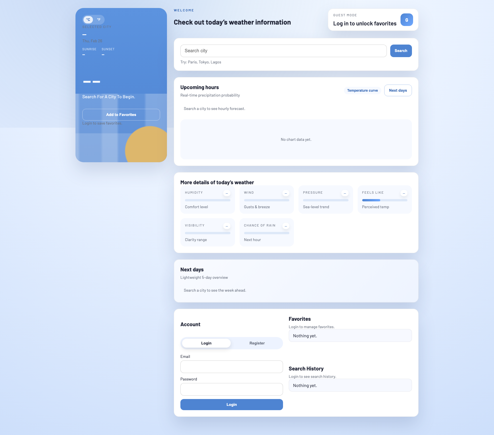
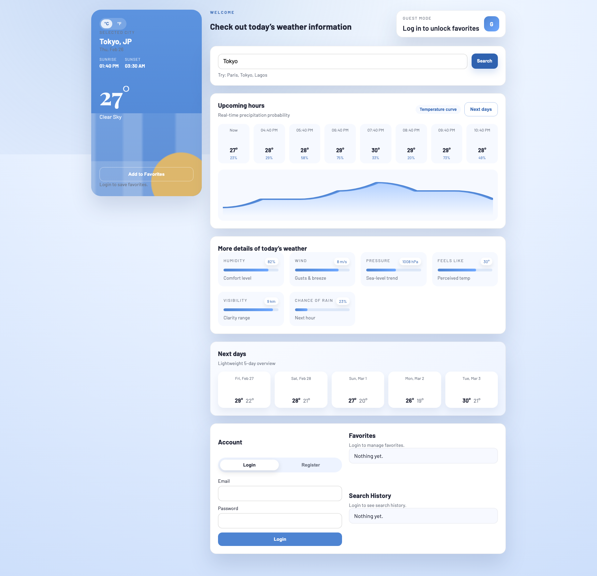
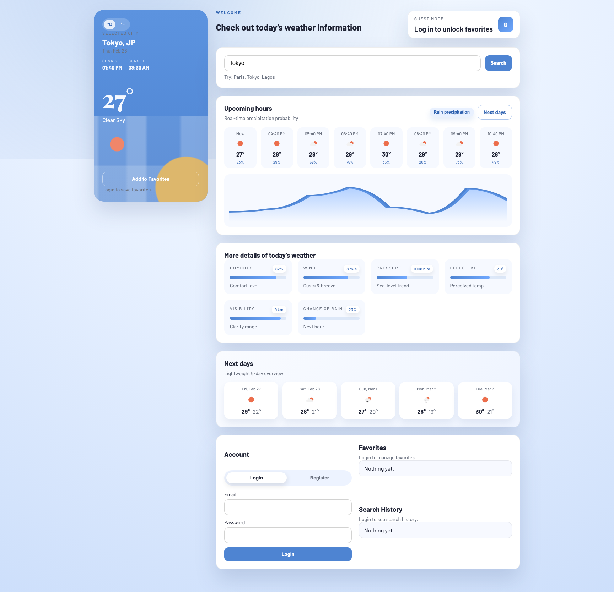
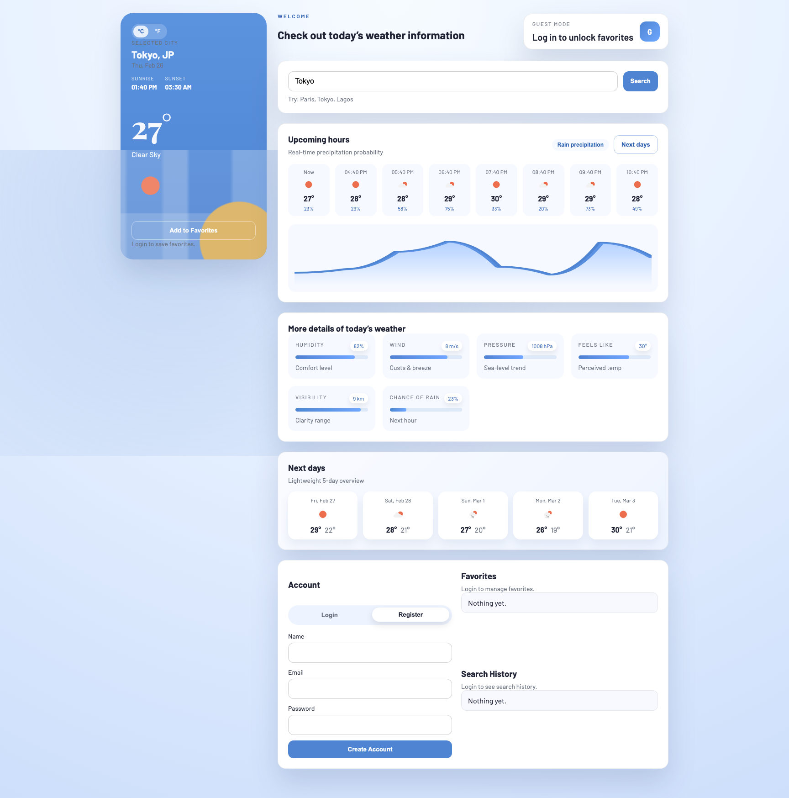
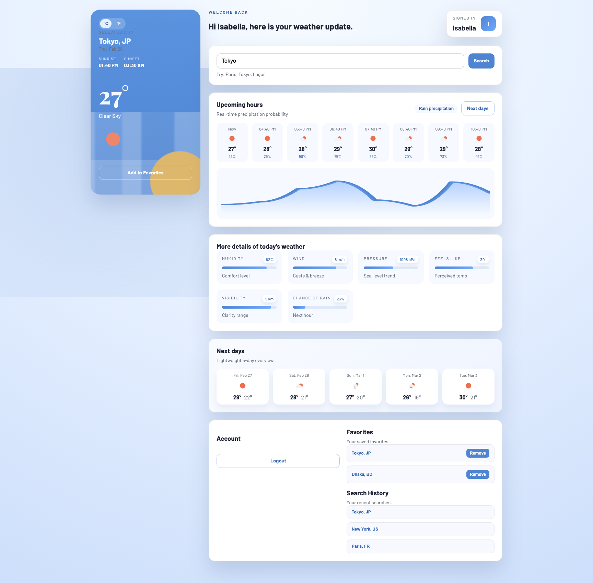

# Weather App

Production-ready full-stack weather app with secure backend proxy, JWT auth, and a modern responsive dashboard UI.

## Tech
- Frontend: React + Vite (responsive, mobile-first)
- Backend: Node.js, Express, MongoDB (Mongoose)
- API: OpenWeatherMap (server-side only)
- Security: Helmet, rate limiting, input validation, JWT auth

## Quick Start
1. Install backend dependencies:

```bash
cd /Users/riyadebnathdas/Desktop/Projects/Weather\ App/server
npm install
```

2. Install frontend dependencies:

```bash
cd /Users/riyadebnathdas/Desktop/Projects/Weather\ App/client
npm install
```

3. Configure environment:

Create `/Users/riyadebnathdas/Desktop/Projects/Weather App/server/.env` and add the required variables:

```env
MONGO_URI=your_mongodb_connection_string
JWT_SECRET=replace_with_a_long_random_secret
OPENWEATHER_API_KEY=your_openweathermap_api_key
PORT=5000
CLIENT_ORIGIN=http://localhost:5173
```

`MONGO_URI`, `JWT_SECRET`, and `OPENWEATHER_API_KEY` are required. `PORT` and `CLIENT_ORIGIN` are optional overrides.

4. Run in development:

```bash
# terminal 1
cd /Users/riyadebnathdas/Desktop/Projects/Weather\ App/server
npm run dev

# terminal 2
cd /Users/riyadebnathdas/Desktop/Projects/Weather\ App/client
npm run dev
```

Open [http://localhost:5173](http://localhost:5173).

## Feature Screenshots
1. Guest dashboard  


2. Weather search with hourly and daily forecast  


3. Rain precipitation chart mode  


4. Register form view  


5. Logged-in view with favorites and search history  


To regenerate screenshots locally:
```bash
cd /Users/riyadebnathdas/Desktop/Projects/Weather\ App/client
npm run screenshots
```

## Production build

```bash
cd /Users/riyadebnathdas/Desktop/Projects/Weather\ App/client
npm run build
```

Then start the server and open [http://localhost:5001](http://localhost:5001). The server serves `/Users/riyadebnathdas/Desktop/Projects/Weather App/client/dist`.

## Deploy On Railway
1. Push this repository to GitHub.

2. In Railway, create a new project from the GitHub repo.

3. Railway will use the root `Dockerfile` automatically, so no custom build or start command is required.

4. Add these Railway environment variables:

```env
MONGO_URI=your_mongodb_connection_string
JWT_SECRET=replace_with_a_long_random_secret
OPENWEATHER_API_KEY=your_openweathermap_api_key
CLIENT_ORIGIN=https://your-app.up.railway.app
```

5. After the first deploy, confirm the API is healthy at `/api/health`.

Railway provides `PORT` automatically, so you do not need to set it manually there.

## Notes
- The backend uses OpenWeatherMap geocoding to support world city names.
- Favorites/history responses are `Cache-Control: no-store` to avoid stale data.
- Auth endpoints are POST only. `GET /api/auth/*` returns 405.

## API
- `GET /api/weather?city=cityName` (current weather + hourly + daily forecast summary)
- `POST /api/auth/register`
- `POST /api/auth/login`
- `GET /api/user/history` (requires auth)
- `GET /api/user/favorites` (requires auth)
- `POST /api/user/favorites` (requires auth, body: `{ "city": "Dhaka", "country": "BD" }`)
- `DELETE /api/user/favorites/:id` (requires auth)

## Auth
Send a token using either header:
- `Authorization: Bearer <token>`
- `x-auth-token: <token>`
